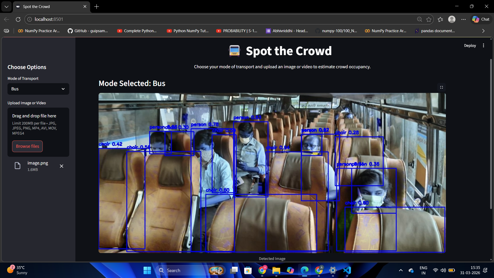

# SpotTheCrowd
A computer vision based yolo public transport crowd occupancy detector 


# 🚍 Spot the Crowd
Estimate crowd occupancy in public transport using Computer Vision & YOLOv8.

## 📌 Overview
**Spot the Crowd** is a Streamlit-based web app that detects:

* 👤 People (occupied seats)
* 🪑 Chairs / benches (vacant seats)

It provides a stimate of occupancy in buses, trains, or metros using images or videos also works on **real-time video frames**
---

## 🖼️ Demo
### 🧠 Detection Output


---

## 📦 Dependencies 

Install everything directly using:

```bash
pip install streamlit opencv-python ultralytics pillow numpy
```
---

## 🧠 How It Works

1. Upload image/video
2. YOLO detects:

   * `person`
   * `chair`
   * `bench`
3. Logic:

   * chair → +1 empty
   * bench → +2 empty
   * person → +1 occupied
4. Final counts displayed
---

## ⚠️ Limitations

* YOLO is not trained specifically for **transport seats**
* May mis-detect:

  * Seats as objects
  * People overlapping
* Bench logic is assumed (not exact)
---
